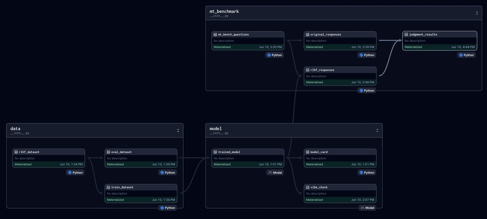

# RLHF with Dagster and Modal!

## Why 

Re-usable & scalable RLHF training pipeline with Dagster and Modal.



Read full story in this blog post: [RLHF with Dagster and Modal](https://kyrylai.com/2024/06/10/rlhf-with-dagster-and-modal/)

## Access

You would need access to 

- [HF](https://huggingface.co/docs/huggingface_hub/quick-start) to save your model.
- [Modal](https://modal.com/docs/guide#getting-started) to use GPU for training.
- [OpenAI](https://openai.com/index/openai-api/) to use GPT-4 for evaluation.

Make sure your .env file looks like this:

```
HF_TOKEN=hf_
MODAL_TOKEN_ID=ak-
MODAL_TOKEN_SECRET=as-
OPENAI_API_KEY=sk
```


## Setup

The recommended way is to use a prebuilt [Docker image](https://github.com/kyryl-opens-ml/rlfh-dagster-modal/pkgs/container/rlfh-dagster-modal). 
```
docker pull ghcr.io/kyryl-opens-ml/rlfh-dagster-modal:main
docker run -it --env-file .env -p 3000:3000 ghcr.io/kyryl-opens-ml/rlfh-dagster-modal:main
```


## Deploy Modal functions 

Make sure you depliyed training & inference function to [Modal](https://modal.com/).

```
modal deploy ./rlhf_training/serverless_functions.py
```

## Run Dagster end2end 

Finally run Dagster.

```
dagster dev -f rlhf_training/__init__.py -p 3000 -h 0.0.0.0
```
